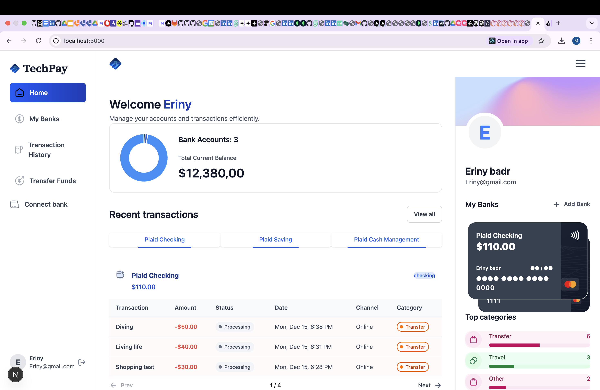
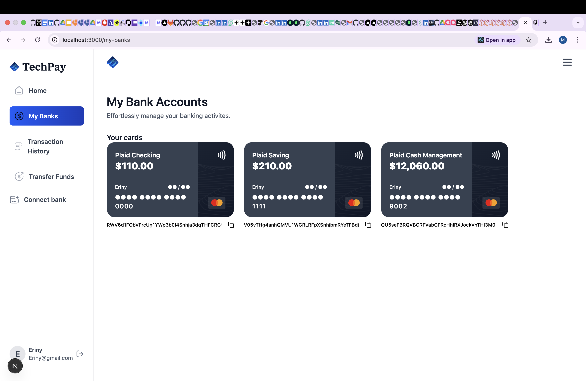
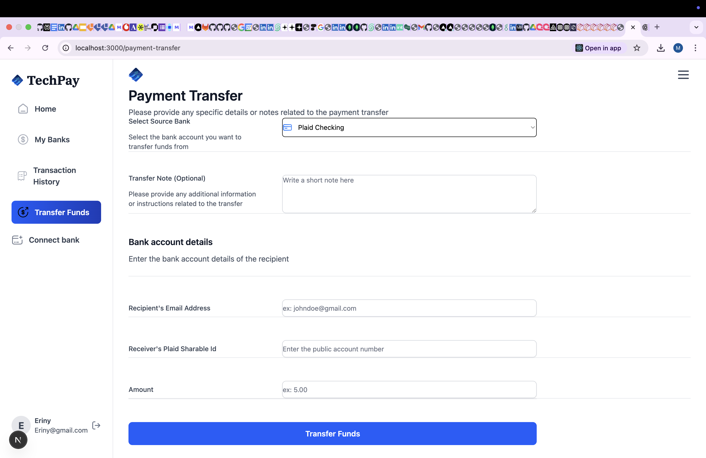
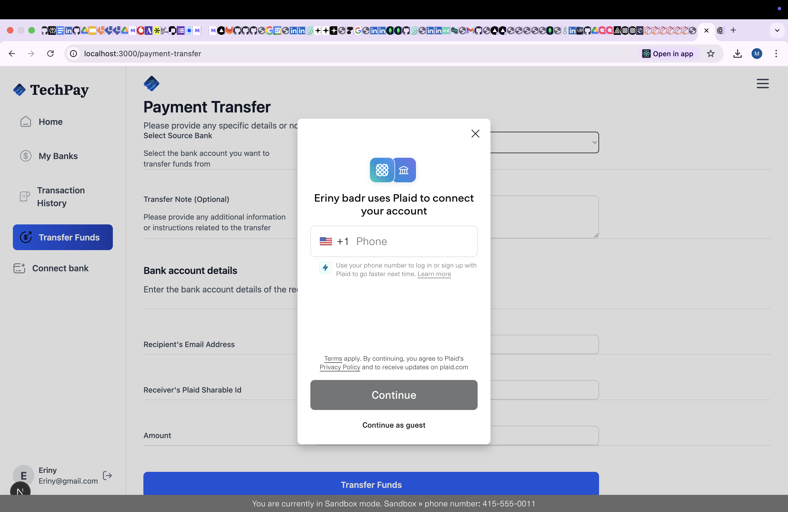

# 💳 TechPay - Modern Banking Application

<div align="center">


**A full-stack banking application built with Next.js, featuring secure bank account connections, real-time transactions, and seamless money transfers.**

[](https://nextjs.org/)
[](https://www.typescriptlang.org/)
[](https://react.dev/)
[](https://tailwindcss.com/)

[Features](#-features) • [Tech Stack](#-tech-stack) • [Getting Started](#-getting-started) • [Screenshots](#-screenshots) • [Project Structure](#-project-structure)

</div>

---

## 🎯 Overview

TechPay is a modern, secure banking application that enables users to connect their bank accounts, view real-time balances, track transactions, and transfer funds seamlessly. Built with cutting-edge technologies, it provides a smooth user experience while maintaining enterprise-level security standards.

### Key Highlights

- 🔐 **Secure Authentication** - User sign-up and sign-in with encrypted credentials
- 🏦 **Bank Integration** - Connect multiple bank accounts via Plaid API
- 💰 **Real-time Balances** - View account balances and transaction history
- 📊 **Transaction Analytics** - Visualize spending with interactive charts
- 🔄 **Money Transfers** - Send funds between accounts using Dwolla payment processing
- 📱 **Responsive Design** - Beautiful UI that works on all devices

---

## ✨ Features

### 🔑 Authentication & User Management
- Secure user registration and login
- Session management with Appwrite
- User profile management
- Automatic user document creation

### 🏦 Bank Account Management
- Connect multiple bank accounts via Plaid Link
- View all connected accounts in one dashboard
- Real-time account balance updates
- Support for checking, savings, and cash management accounts
- Shareable account IDs for easy transfers

### 💸 Payment Transfers
- Send money between bank accounts
- Real-time transfer processing via Dwolla
- Transfer history tracking
- Duplicate transaction prevention
- Automatic funding source management

### 📈 Transaction History
- Complete transaction history view
- Filter transactions by account
- Transaction categorization
- Status tracking (Processing, Completed, Pending)
- Pagination for large transaction lists

### 📊 Dashboard & Analytics
- Visual balance overview with donut charts
- Recent transactions display
- Top spending categories
- Account summary cards
- Responsive sidebar navigation

---

## 🛠️ Tech Stack

### Frontend
- **Next.js 16.0.7** - React framework with App Router
- **React 19.2.0** - UI library
- **TypeScript** - Type-safe development
- **Tailwind CSS 4.0** - Utility-first CSS framework
- **Radix UI** - Accessible component primitives
- **Chart.js** - Data visualization
- **React Hook Form** - Form management
- **Zod** - Schema validation

### Backend & APIs
- **Appwrite** - Backend-as-a-Service for authentication and database
- **Plaid API** - Bank account connection and transaction data
- **Dwolla API** - Payment processing and money transfers
- **Next.js Server Actions** - Server-side logic

### Development Tools
- **ESLint** - Code linting
- **TypeScript** - Static type checking
- **Sentry** - Error tracking and monitoring

---

## 🚀 Getting Started

### Prerequisites

- Node.js 18+ and npm/yarn/pnpm
- Appwrite account and project
- Plaid API credentials (sandbox or production)
- Dwolla API credentials (sandbox or production)

### Installation

1. **Clone the repository**
   ```bash
   git clone https://github.com/mirnabadr/banking.git
   cd banking
   ```

2. **Install dependencies**
   ```bash
   npm install
   # or
   yarn install
   # or
   pnpm install
   ```

3. **Set up environment variables**
   
   Create a `.env.local` file in the root directory:
   ```env
   # Appwrite Configuration
   NEXT_PUBLIC_APPWRITE_ENDPOINT=your_appwrite_endpoint
   NEXT_PUBLIC_APPWRITE_PROJECT_ID=your_project_id
   APPWRITE_API_KEY=your_api_key
   APPWRITE_DATABASE_ID=your_database_id
   APPWRITE_USER_COLLECTION_ID=your_user_collection_id
   APPWRITE_BANK_COLLECTION_ID=your_bank_collection_id
   APPWRITE_TRANSACTION_COLLECTION_ID=your_transaction_collection_id

   # Plaid Configuration
   PLAID_CLIENT_ID=your_plaid_client_id
   PLAID_SECRET=your_plaid_secret
   PLAID_ENV=sandbox
   PLAID_PRODUCTS=transactions

   # Dwolla Configuration
   DWOLLA_KEY=your_dwolla_key
   DWOLLA_SECRET=your_dwolla_secret
   DWOLLA_ENV=sandbox
   ```

4. **Run the development server**
   ```bash
   npm run dev
   # or
   yarn dev
   # or
   pnpm dev
   ```

5. **Open your browser**
   
   Navigate to [http://localhost:3000](http://localhost:3000)

---

## 📸 Screenshots

### Dashboard Overview

*Main dashboard showing account balances, recent transactions, and account summary*

### Bank Account Management

*View and manage all connected bank accounts with shareable IDs*

### Transaction History

*Complete transaction history with filtering and pagination*

### Payment Transfer

*Secure money transfer interface with bank account selection*

### Authentication

*Clean and secure authentication interface*

---

## 📁 Project Structure

```
banking/
├── app/                      # Next.js App Router
│   ├── (auth)/              # Authentication routes
│   │   ├── sign-in/
│   │   └── sign-up/
│   ├── (root)/              # Protected routes
│   │   ├── my-banks/
│   │   ├── payment-transfer/
│   │   └── transaction-history/
│   └── api/                 # API routes
│       ├── create-personal-funding-source/
│       ├── fix-receiver-funding-sources/
│       └── test-receive-only/
├── components/              # React components
│   ├── ui/                 # Reusable UI components
│   ├── AuthForm.tsx
│   ├── BankCard.tsx
│   ├── PaymentTransferForm.tsx
│   └── TransactionsTable.tsx
├── lib/                     # Utility functions and actions
│   ├── actions/            # Server actions
│   │   ├── bank.actions.ts
│   │   ├── dwolla.actions.ts
│   │   ├── transaction.actions.ts
│   │   └── user.action.ts
│   ├── appwrite.ts
│   ├── plaid.ts
│   └── utils.ts
├── public/                 # Static assets
│   └── icons/
├── types/                  # TypeScript type definitions
│   └── index.d.ts
└── constants/              # Application constants
    └── index.ts
```

---

## 🔒 Security Features

- **Encrypted Credentials** - All user passwords are securely hashed
- **Session Management** - Secure HTTP-only cookies for sessions
- **API Security** - Server-side API key management
- **Data Encryption** - Sensitive data encrypted at rest
- **Input Validation** - Zod schema validation for all inputs
- **Duplicate Prevention** - Prevents duplicate transactions

---

## 🎨 Key Features Implementation

### Bank Account Connection
- Seamless Plaid Link integration
- Automatic account synchronization
- Real-time balance updates
- Support for multiple account types

### Payment Processing
- Dwolla integration for secure transfers
- Automatic funding source management
- Transfer status tracking
- Error handling and retry logic

### Transaction Management
- Real-time transaction fetching from Plaid
- Local transaction storage in Appwrite
- Duplicate detection and prevention
- Transaction categorization

---

## 🧪 Testing

The application includes comprehensive error handling and validation:

- Form validation with Zod schemas
- API error handling
- Transaction duplicate prevention
- Funding source validation

---

## 📝 Environment Variables

Make sure to set up all required environment variables before running the application. Refer to the `.env.local.example` file (create one if needed) for all required variables.

---

## 🚢 Deployment

### Deploy on Vercel

1. Push your code to GitHub
2. Import your repository in Vercel
3. Add environment variables in Vercel dashboard
4. Deploy!

The application is optimized for Vercel deployment with Next.js.

---

## 🤝 Contributing

Contributions are welcome! Please feel free to submit a Pull Request.

1. Fork the repository
2. Create your feature branch (`git checkout -b feature/AmazingFeature`)
3. Commit your changes (`git commit -m 'Add some AmazingFeature'`)
4. Push to the branch (`git push origin feature/AmazingFeature`)
5. Open a Pull Request

---

## 📄 License

This project is licensed under the MIT License.

---

## 👨‍💻 Author

**Mirna Badr**

- GitHub: [@mirnabadr](https://github.com/mirnabadr)
- Repository: [banking](https://github.com/mirnabadr/banking)

---

## 🙏 Acknowledgments

- [Next.js](https://nextjs.org/) - The React Framework
- [Appwrite](https://appwrite.io/) - Backend-as-a-Service
- [Plaid](https://plaid.com/) - Financial Services API
- [Dwolla](https://www.dwolla.com/) - Payment Processing API
- [Tailwind CSS](https://tailwindcss.com/) - CSS Framework
- [Radix UI](https://www.radix-ui.com/) - UI Components

---

<div align="center">

**Built with ❤️ using Next.js and modern web technologies**

⭐ Star this repo if you find it helpful!

</div>
